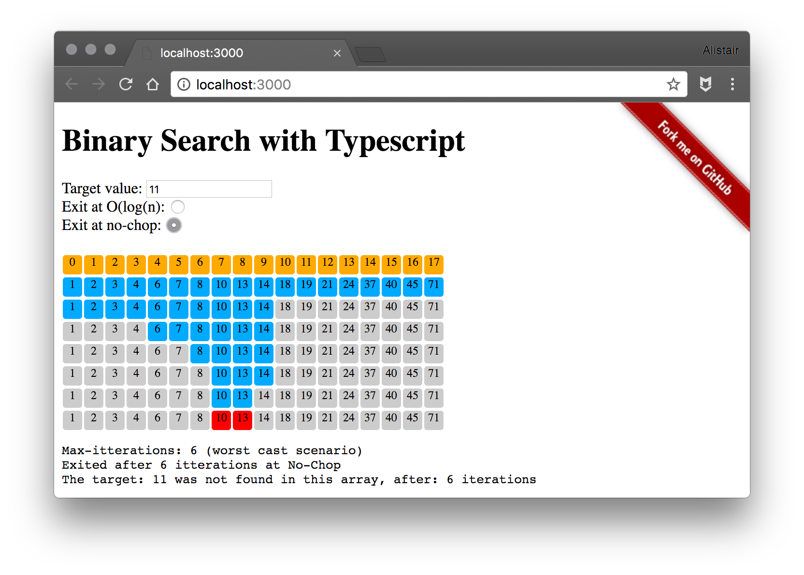

# Binary Search with Typescript

This is a quick example of a Binary Search implemented in Typescript.

- Demo: [https://f1lt3r.github.io/binary-search-in-typescript/](https://f1lt3r.github.io/binary-search-in-typescript/)
- Blog Post: [https://f1lt3r.io/binary-search-with-typescript/](https://f1lt3r.io/binary-search-with-typescript/)

## Screenshots

### Worst Case Performance

### Target Found

### Exhausted Array

